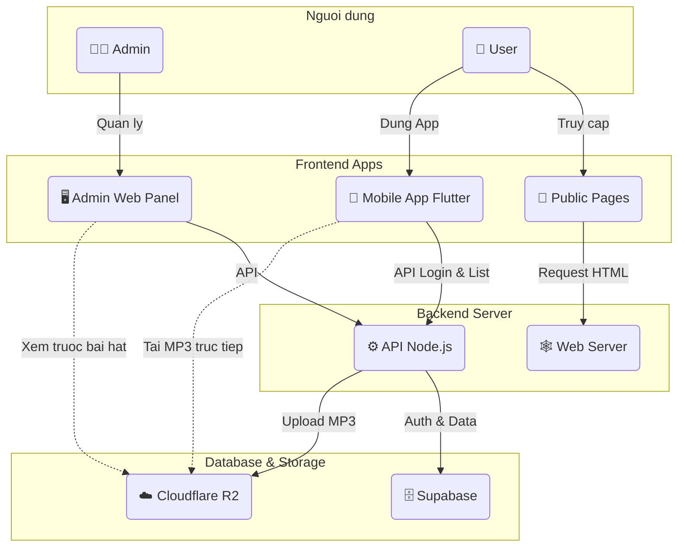

# **Karaoke Entertainment Plus**

# 1. Giới thiệu:
**Karaoke Entertainment Plus** là một app karaoke để người dùng ca hát giải trí, ở đây người dùng có thể
hát một hoặc hát cùng mọi người, tạo các phòng hát và chia sẻ những đoạn cover 'đỉnh cao' để mọi người
cùng nhau thưởng thức.

# 2. Yêu cầu môi trường:
Để chạy dự án này, máy tính của bạn BẮT BUỘC phải có:
1. **Flutter SDK:** Phiên bản Stable mới nhất (>= 3.24.x).
    - Kiểm tra bằng lệnh: `flutter --version`
2. **Java JDK:** Phiên bản 17 (Bắt buộc cho Android Gradle Plugin mới).
    - Kiểm tra bằng lệnh: `java -version`
    - Nếu chưa có, hãy cài đặt OpenJDK 17.

# 3. Cách chạy dự án:

1. Clone dự án về máy:

        git clone https://github.com/Phap625/App-karaoke.git
2. Khởi chạy máy ảo.

3. Chạy file [setup.bat](setup.bat) (trên Windows) để cài đặt và khởi động bằng lệnh:

        .\setup.bat

4. Fix lỗi(nếu có) bằng lệnh:

        https://gemini.google.com

# 4. Sơ đồ hoạt động hệ thống:

