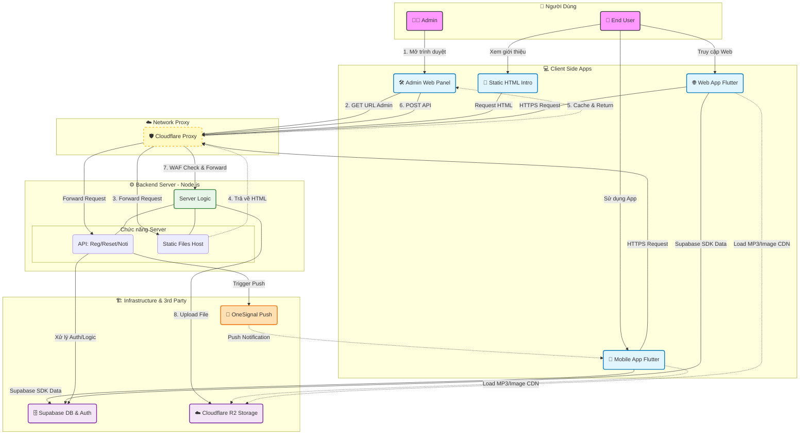

# 🎤 KARAOKE PLUS
# 1. Giới thiệu:
Dự án xây dựng một ứng dụng di động  (Mobile App) kết hợp giữa trải nghiệm hát Karaoke và Mạng xã hội. Ứng dụng cho phép người dùng tìm kiếm bài hát, thu âm giọng hát trên nền nhạc beat, và chia sẻ các bản thu (Moments) lên bảng tin chung. Cho phép các tương tác xã hội (chat, like, comment, follow) giúp nâng cao trải nghiệm người dùng.

# 2. Các tính năng chính:
**Thu âm & Xử lý âm thanh:** Người dùng có thể hát và thu âm với beat nhạc chất lượng cao, hệ thống tự động trộn (merge) giọng hát và nhạc nền.

**Mạng xã hội:** Đăng tải bản thu dưới dạng bài viết (Moment), hiển thị bài đăng từ bạn bè và cộng đồng.

**Tương tác thời gian thực:** Tính năng Thả tim (Like), Bình luận (Comment) và nhận Thông báo (Notification) ngay lập tức khi có tương tác mới.

**Hệ thống quản trị (Admin Dashboard):** Trang web quản trị giúp theo dõi thống kê hệ thống, quản lý người dùng, bài hát và xử lý các báo cáo vi phạm.

# 3. Cấu trúc dự án:
Dự án được chia thành 2 thư mục chính:
```text
Karaoke/
├── client/          # Mã nguồn ứng dụng Mobile (Flutter)
│   ├── lib/         # Logic chính và giao diện
│   ├── android/     # Cấu hình Android native
│   └── web/         # Cấu hình web native
│
└── server/          # Mã nguồn Backend (Node.js)
    ├── routes/      # Các API endpoints
    └── public/      # Web Admin Dashboard & Static files
    └── services/    # Hỗ trợ upload Media, push Notifications
```

# 4. Công nghệ sử dụng:
**Mobile App:** Flutter (Dart).

**Web Admin:** Node.js.

**Cơ sở dữ liệu (Database):** Supabase (PostgreSQL), Supabase Auth.

**Lưu trữ (Storage):** Cloudflare R2 (Lưu trữ file âm thanh & hình ảnh).

**Realtime:** Supabase Realtime.

# 5. Cài đặt & triển khai:
## 1. Yêu cầu môi trường:
**Đối với client:**

Flutter SDK: Phiên bản Stable mới nhất (>= 3.24.x).

Java JDK: Phiên bản 17 (Bắt buộc cho Android Gradle Plugin mới). Kiểm tra bằng lệnh:

        flutter --version
        java -version
**Đối với server:**

 Node.js phiên bản v22.0.x trở lên, npm phiên bản 10.8.x trở lên. Kiểm tra bằng lệnh:

        node -v
        npm -v
## 2. Triển khai
### Clone Repository:

        https://github.com/HPhi1808/Karaoke.git

### Đối với server:
#### 1. Di chuyển vào folder server:

        cd server
#### 2. Cài đặt môi trường:

        npm install
#### 3. Tạo file biến môi trường:

        copy .env.example .env
#### 4. Gán giá trị vào các Key trong file .env vừa tạo
#### 5. Khởi chạy:

        npm start

### Đối với client:
#### 1. Di chuyển vào folder client:

        cd client
#### 2. Cài đặt môi trường:

        flutter pub get
#### 3. Tạo file biến môi trường:

        copy .env.example .env
#### 4. Gán giá trị vào các Key trong file .env vừa tạo
#### 5. Khởi chạy:

        flutter run

# 6. Sơ đồ hoạt động:

